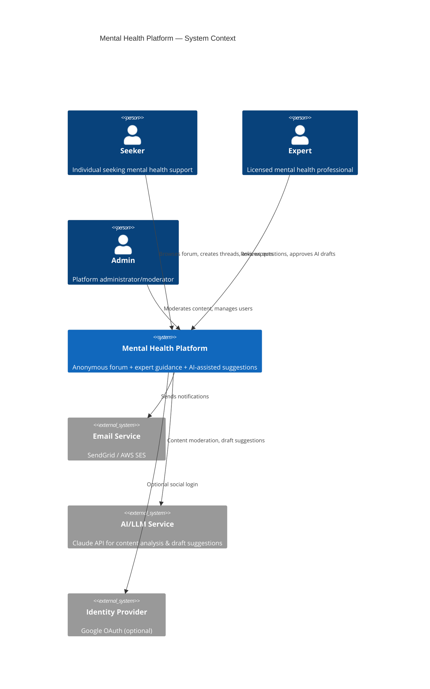
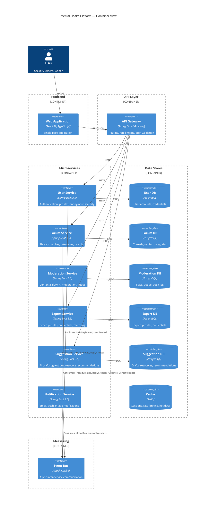

# System Architecture Overview

## C4 Context Diagram

## C4 Container Diagram

## Service Responsibilities

| Service | Owns | Phase |
|---------|------|-------|
| **User Service** | Registration, auth, JWT, profiles, anonymous identity | Phase 1 |
| **Forum Service** | Categories, threads, replies, search | Phase 1 |
| **Moderation Service** | Content scanning, flag queue, moderation actions, audit log | Phase 1 (basic) → Phase 2 (AI) |
| **Expert Service** | Expert onboarding, credential verification, availability, matching | Phase 3 |
| **Suggestion Service** | AI draft generation, expert review workflow, resource library | Phase 4 |
| **Notification Service** | Email digests, mention alerts, crisis alerts, push notifications | Phase 1 (basic) → Phase 3 (full) |
| **API Gateway** | Routing, auth token validation, rate limiting, CORS | Phase 1 |

## Inter-Service Communication

All service-to-service communication is **event-driven via Kafka**. No direct HTTP calls between services.

See: [Event-Driven Architecture](event-driven.md)

## Technology Stack Summary

| Layer | Technology | Version |
|-------|-----------|---------|
| Language | Java | 21+ |
| Framework | Spring Boot | 3.5.x |
| API Gateway | Spring Cloud Gateway | 2024.x |
| Database | PostgreSQL | 16 |
| Cache | Redis | 7.x |
| Messaging | Apache Kafka | 3.7+ |
| Search | PostgreSQL Full-Text (Phase 1) → Elasticsearch (Phase 3+) | — |
| AI/LLM | Claude API (Anthropic) | Latest |
| Container Runtime | Docker | 24+ |
| Local Orchestration | Kubernetes (Docker Desktop) | 1.29+ |
| Production Orchestration | AWS ECS Fargate | — |
| IaC | Terraform | 1.7+ |
| CI/CD | GitHub Actions | — |
| Monitoring | Prometheus + Grafana | — |
| Tracing | OpenTelemetry + Jaeger | — |
